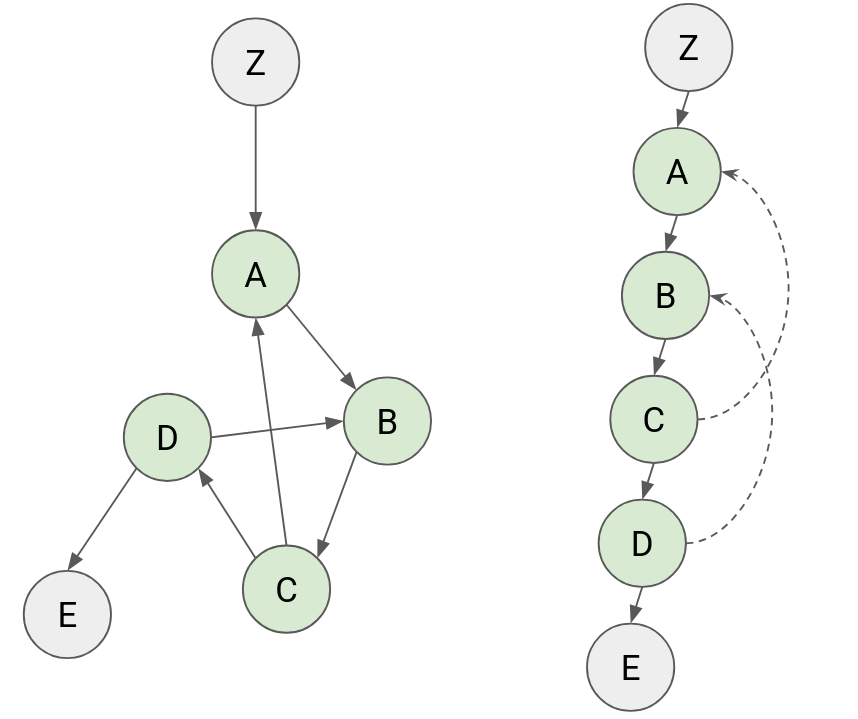

# Tarjan SCC


 

<https://en.wikipedia.org/wiki/Tarjan%27s_strongly_connected_components_algorithm>
1. (Solid line) Update lowlink after dfs.
2. (Dotted line) Update lowlink at the back edges to the same SCC.


```rust
struct TarjanSCC {
    order: usize,
    index: Vec<usize>,
    lowlink: Vec<usize>,
    stack: Vec<usize>,
    onstack: Vec<bool>,
    scc_id: usize,
    belong: Vec<usize>,
}

impl TarjanSCC {
    fn dfs(&mut self, u: usize, adj: &Vec<Vec<usize>>) {
        self.index[u] = self.order;
        self.lowlink[u] = self.order;
        self.order += 1;
        self.stack.push(u);
        self.onstack[u] = true;

        for &v in &adj[u] {
            if self.index[v] == !0 {
                self.dfs(v, adj);
                self.lowlink[u] = self.lowlink[u].min(self.lowlink[v]);
            } else if self.onstack[v] {
                self.lowlink[u] = self.lowlink[u].min(self.index[v]);
            }
        }

        if self.index[u] == self.lowlink[u] {
            while let Some(v) = self.stack.pop() {
                self.belong[v] = self.scc_id;
                self.onstack[v] = false;
                if v == u {
                    break;
                }
            }
            self.scc_id += 1;
        }
    }

    fn from_adj(adj: &Vec<Vec<usize>>) -> (usize, Vec<usize>) {
        let n = adj.len();
        let mut data = TarjanSCC {
            order: 0,
            index: vec![!0; n],
            lowlink: vec![!0; n],
            stack: vec![],
            onstack: vec![false; n],
            scc_id: 0,
            belong: vec![!0; n],
        };
        for u in 0..n {
            if data.index[u] == !0 {
                data.dfs(u, &adj);
            }
        }
        (data.scc_id, data.belong)
    }
}
```

* The order of the scc is the **reversed** topological sort. 
* Tarjan SCC can be used to find **directed cycles**.

```rust
let (num_scc, belong) = TarjanSCC::from_adj(&adj);

// Reconstruct SCCs
let mut sccs = vec![vec![]; num_scc];
for u in 0..n {
    sccs[belong[u]].push(u);
}

// Inspect the scc topologically
for scc in scc.iter().rev() {
    // ...
}

// To check if u goes prior to v
if belong[u] > belong[v] {
    // ...
}

// Find all directed cycle
for i in 0..num_scc {
    if sccs[i].len() >= 2 || (sccs[i].len() == 1 && adj[sccs[i][0]][0] == sccs[i][0]) {
        // sccs[i] is a cycle or self loop
    }
}
```

SCC: [Practice2-G](https://atcoder.jp/contests/practice2/submissions/69190437)
Cycle: [ABC357E](https://atcoder.jp/contests/abc357/submissions/54387589)