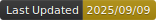

# amoshuangyc

   

I reread the problem, drew many lines on paper, pondered for a moment, and scanned my codebook again... Ah! I can't solve this problem.

## This Book

* Created using [mdbook](https://github.com/rust-lang/mdBook).
* Syntax highlighting in light theme is [Github](https://github.com/highlightjs/highlight.js/blob/main/src/styles/github.css) with modified background.
* Rating badges are created in prior using this [script](https://github.com/amoshyc/cp-codebook/blob/main/create_images.py).
* Best viewed in Firefox. If you are using others, suggest to enable overlay-scrollbars.
* Add a [custom.css](https://github.com/amoshyc/cp-codebook/blob/main/theme/custom.css).
    - Apply `overflow-x: auto` to code block.
    - Apply `white-space: pre-wrap` to `p` to allow easy line break.
    - Customize the style of `blockquote`.
* Modify [index.hbs](https://github.com/amoshyc/cp-codebook/blob/main/theme/index.hbs).
    - Include the mathjax that supports [AsciiMath](https://asciimath.org/).
