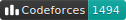

# amoshuangyc

I reread the problem, drew many lines on paper, pondered for a moment, and scanned my codebook again... Ah! I can't solve this problem.

## This Book

* Created by [mdbook](https://github.com/rust-lang/mdBook).
* Syntax Highlightning color theme is [Github](https://github.com/highlightjs/highlight.js/blob/main/src/styles/github.css) with modified background.
* With custom.css adding `overflow-x: scroll` to code block.
* Customized the mathjax to allow writing in [AsciiMath](https://asciimath.org/).
* Rating badges created in prior using this [script](https://github.com/amoshyc/cp-codebook/blob/main/create_images.py).