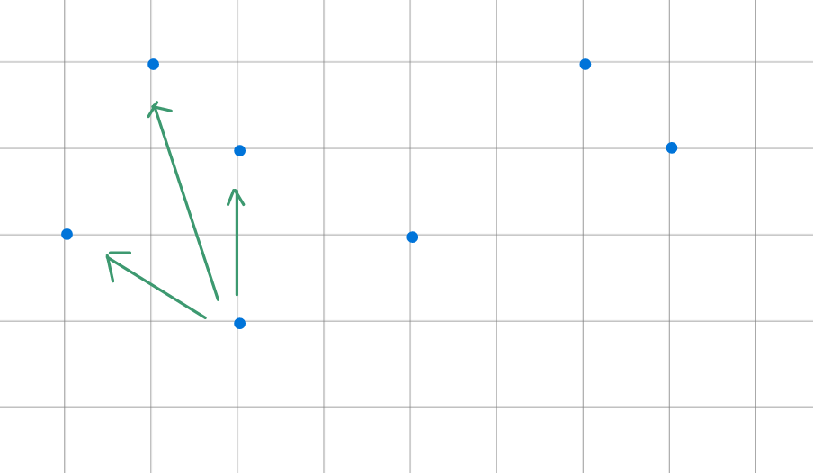

# 2D Poset

> Given `N` position in a `HxW (H < 2e5, W < 2e5)` grid. Starting from the top left and ending in the bottom right, how many position can be arrived if only move right or move down.

[ABC369F](https://atcoder.jp/contests/abc369/submissions/58176075)

> Given `N (N < 2e5)` points on a plane, how many pair `(i, j)` satisfies `X[i] < X[j]` and `Y[i] > Y[j]`.

For each point `(X[i], Y[i])`, find how many other points is at its upper-left.

1. Prepare a BIT to store the number points at each `Y` coordinates.
2. Inspect all the points from left to right. 
3. For point `(X[i], Y[i])`:
    - Query the BIT to find how many previous points is at its upper-left.
    - Add `Y[i]` to the BIT.

May need to do coordinate compression in prior. Be aware the points may be repeated.

[ABC231F](https://atcoder.jp/contests/abc231/submissions/43081686)

