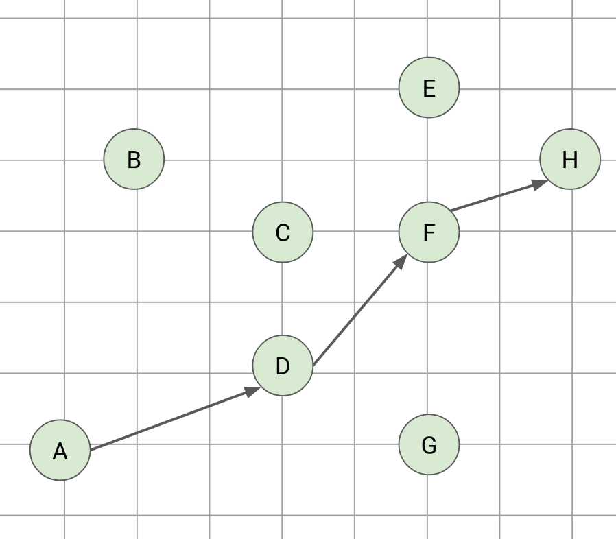
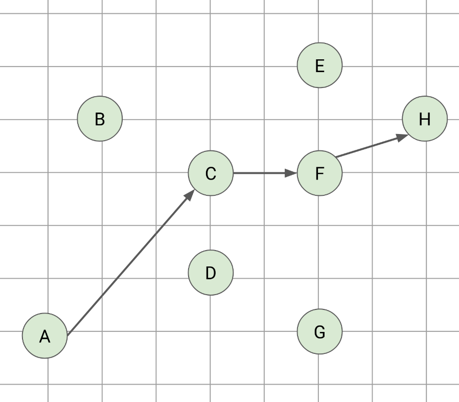

# 2D Poset

## The Length of The Longest Chain 

> Given `N` points on 2D plane, what is the length of the longest chain such that `x[i] < x[j]` and `y[i] < y[j]`? [ABC439E](https://atcoder.jp/contests/abc439/submissions/72225104), [ABC369F](https://atcoder.jp/contests/abc369/submissions/58176075)

We want to find the length of the lonegst chain that extends from bottom left to top right. 
The problem can be converted to [LIS (Longest Increasing Subsequence)](../algorithms/longest_increasing_subsequence.md):

```rust
xy.sort_by_key(|&(x, y)| (x, Reverse(y)));
let ys = xs.iter().map(|&(x, y)| y).collect();
let dp = longest_increasing_subsequence(&bs, !0);
let ans = dp.iter().max.unwrap();
```

---

From the geometry viewpoint, we are inspecting these 2D points from left to right while finding the chains that are increasing in the y-axis, that is, the longest increasing subsequence of the `y`. 

if the problem ask for `x[i] < x[j]` instead of `x[i] <= x[j]`, then we choose only one point when there are multiple points in the same vertical line. The easiest way to do it is to inspect those points from top to bottom. This leads to the `(x, Reverse(y))` in the aforementioned code. Contrarily, if we can choose multiple points in the same vertical line, we should sort the points via `(x, y)`.

If the problem ask for `y[i] <= y[j]` instead of `y[i] < y[j]`, then we can choose same y-value points. This can be implemented as finding **LWIS** (Longest Weakly Increasing Subsequence) instead of LIS.


Note the order we inspect the points is labeled as alphabet in figures. 

| Image | Condition | Sort | DP |
| - | - | - | - |
| Figure 1 | `(x[i] < x[j]) && (y[i] < y[j])` | `(x, Reverse(y))` | LIS |
| Figure 2 | `(x[i] < x[j]) && (y[i] <= y[j])`| `(x, Reverse(y))` | LWIS |
| Figure 3 | `(x[i] <= x[j]) && (y[i] < y[j])`| `(x, y)` | LIS |
| Figure 4 | `(x[i] <= x[j]) && (y[i] <= y[j])`| `(x, y)` | LWIS |


Figure 1 / Figure 2:


&nbsp;


Figure 3 / Figure 4:


&nbsp;


## Number of Pairs

> Given `N (N < 2e5)` points on a plane, how many pair `(i, j)` satisfies `X[i] < X[j]` and `Y[i] > Y[j]`.

For each point `(X[i], Y[i])`, find how many other points is at its upper-left.

1. Prepare a BIT to store the number points at each `Y` coordinates.
2. Inspect all the points from left to right. 
3. For point `(X[i], Y[i])`:
    - Query the BIT to find how many previous points is at its upper-left.
    - Add `Y[i]` to the BIT.


May need to do coordinate compression in prior. Be aware the points may be repeated.

[ABC231F](https://atcoder.jp/contests/abc231/submissions/43081686)

